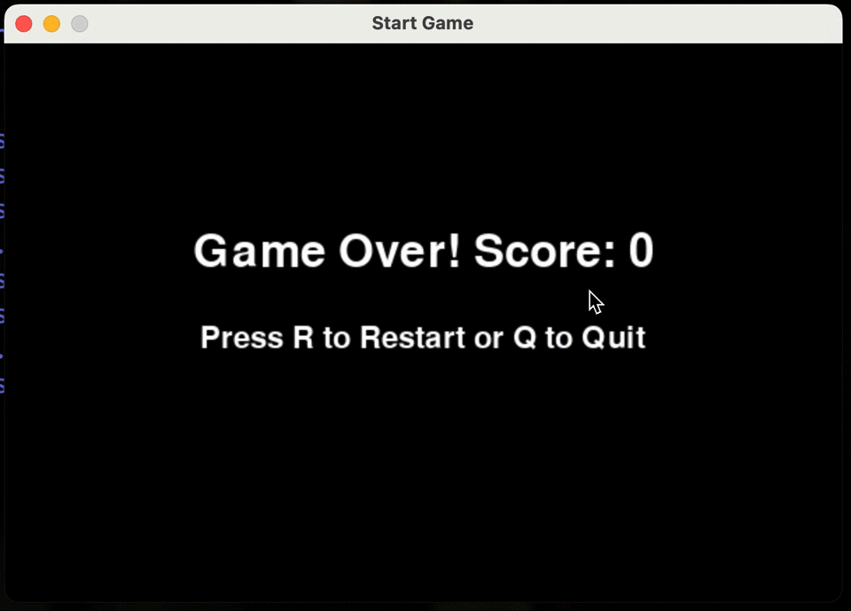

# Snake Game (Pygame)

This is a classic snake game built using **Python** and **Pygame**. Control the snake, eat the food, and try not to crash into yourself or the wall.

## How to Play

- Use **arrow keys** (↑ ↓ ← →) to move the snake.
- Eat the red food to grow longer and increase your score.
- Avoid hitting the walls or your own body, that ends the game.

## Requirements

- Python 3.7+
- Pygame library

## Installation
- **Clone or Download the Repository**
`git clone https://github.com/amitesh786/py-snake-game.git`

- **Create a virtual environment (optional but recommended)**
    - `python3 -m venv venv`
    - `source venv/bin/activate`  # macOS/Linux
    - `venv\Scripts\activate`     # Windows
- **Install dependencies**
- `pip install pygame`

## Run the Game
- `python3 main.py`
- A game window will open. Use the arrow keys to start playing.

## Project Structure
- ├── main.py
- ├── README.md
- └── requirements.txt

## Features
- Simple and clean Pygame loop
- Collision detection with walls and self
- Growing snake with food pickups
- Score tracking (in terminal)

## Demo

## Future Enhancements
- Add sound effects
- High score tracking

## Developer Setup
- Clone the repository: `git clone https://github.com/amitesh786/py-snake-game.git`

## Author Amitesh Singh – [GitHub](https://github.com/amitesh786)
- Feel free to contribute or suggest improvements! 🙌
